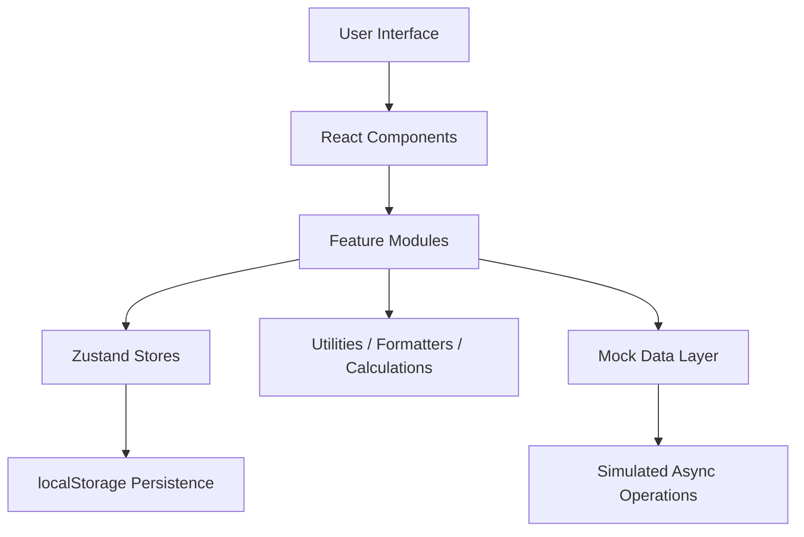
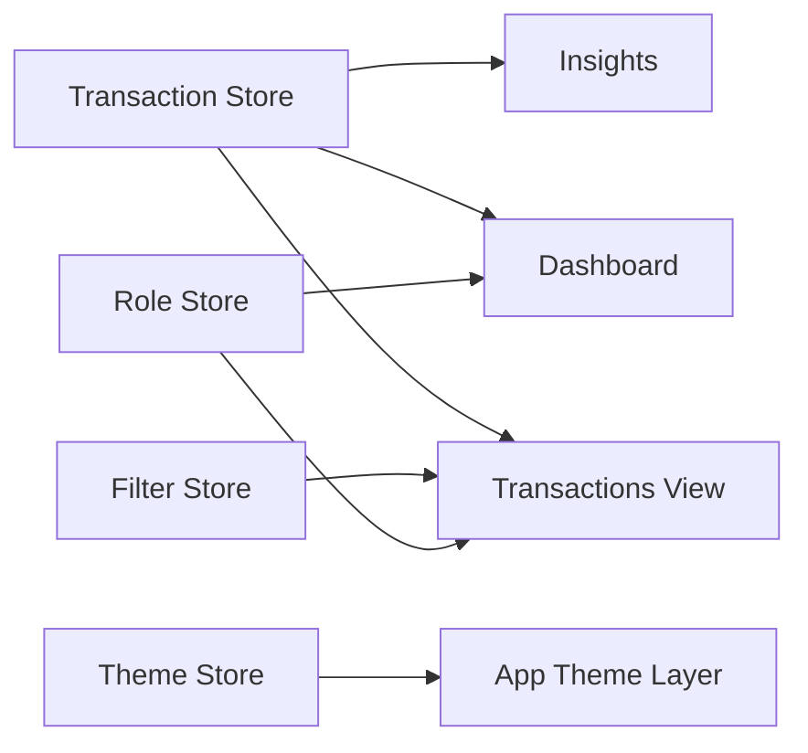
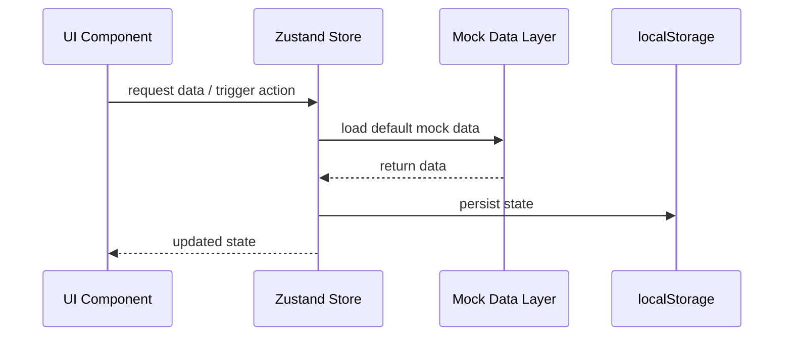

# Technical Requirements Document (TRD)

## Financial Dashboard Web Application

**Document Version:** 1.0  
**Project Type:** Frontend-only Single Page Application  
**Target Platform:** Modern desktop and mobile browsers  
**Implementation Model:** Static/mock data, no backend integration

---

## 1. Purpose and Scope

This document defines the technical requirements for a production-quality **Financial Dashboard** web application built as a **frontend-only React SPA**. The application will provide users with a clear, interactive interface for viewing financial summaries, exploring transactions, monitoring trends, and reviewing insights using static/mock data.

### 1.1 Goals
- Deliver a polished, responsive financial dashboard UI
- Use a modern React + TypeScript architecture
- Simulate asynchronous data interactions entirely on the client
- Support role-based UI behavior for `admin` and `viewer`
- Maintain high standards for accessibility, performance, and maintainability

### 1.2 Non-Goals
- No backend server or database
- No real API integration
- No authentication service
- No payment processing or external financial system connectivity

---

## 2. Architecture Overview

The application shall be implemented as a **Single Page Application (SPA)** using **React 19 + TypeScript**, bundled with **Vite** for fast development workflows and optimized production builds.

### 2.1 Architectural Principles
- **Client-side only**
- **Component-driven UI**
- **Feature-based modular structure**
- **Centralized local state with Zustand**
- **Mock data with simulated async behavior**
- **Production-quality frontend implementation**

### 2.2 High-Level Architecture



### 2.3 Runtime Model
- The app loads static assets from a CDN or static hosting provider
- Mock transaction data is initialized locally
- Data mutations are performed in-memory and persisted to `localStorage` where applicable
- Async behavior is simulated with promises and delays to mimic realistic UI loading states

---

## 3. Tech Stack Details

| Technology | Version | Purpose |
|---|---|---|
| React | 19.x | UI framework |
| TypeScript | 5.x | Type safety |
| Vite | 6.x | Build tool |
| Tailwind CSS | 4.x | Utility-first styling |
| Zustand | 5.x | State management |
| Recharts | 2.x | Charts/data visualization |
| Framer Motion | 12.x | Animations |
| Lucide React | latest | Icons |
| date-fns | latest | Date formatting/manipulation |

### 3.1 Technology Rationale
- **React 19** provides a modern declarative UI foundation
- **TypeScript 5** enforces reliable data contracts and safer refactoring
- **Vite 6** ensures fast HMR and optimized output
- **Tailwind CSS 4** accelerates consistent, responsive design implementation
- **Zustand 5** provides lightweight, scalable client-side state management
- **Recharts** supports accessible, responsive chart rendering
- **Framer Motion** adds polished micro-interactions and transitions
- **Lucide React** supplies consistent, tree-shakeable icons
- **date-fns** enables lightweight date parsing, formatting, and comparisons

---

## 4. Project Structure

The project shall follow a **feature-based folder structure** with separation between shared UI, domain features, state, hooks, utilities, and static data.

```text
src/
├── components/          # Shared UI components
│   ├── ui/             # Base UI elements (Button, Card, Badge, etc.)
│   ├── layout/         # Layout components (Sidebar, Header, MainLayout)
│   └── charts/         # Chart wrapper components
├── features/           # Feature modules
│   ├── dashboard/      # Dashboard overview (summary cards, charts)
│   ├── transactions/   # Transaction list, filters, forms
│   ├── insights/       # Insights section
│   └── settings/       # Theme toggle, role switch
├── stores/             # Zustand stores
│   ├── useTransactionStore.ts
│   ├── useFilterStore.ts
│   ├── useRoleStore.ts
│   ├── useThemeStore.ts
│   └── useInsightsStore.ts
├── pages/              # Page components (route targets)
│   ├── DashboardPage.tsx
│   ├── TransactionsPage.tsx
│   ├── InsightsPage.tsx
│   └── SettingsPage.tsx
├── hooks/              # Custom hooks
├── utils/              # Utilities (formatters, calculations)
├── data/               # Mock data and types
│   ├── mockTransactions.ts
│   └── categories.ts
├── types/              # TypeScript types/interfaces
├── App.tsx
├── main.tsx
└── index.css
```

### 4.1 Structure Guidelines
- Shared components must remain presentation-focused and reusable
- Feature modules must own feature-specific composition logic
- Stores must be isolated by concern
- Utility functions must be pure where possible
- Types must be centralized for consistency and reuse

---

## 5. Functional Architecture

### 5.1 Core Functional Areas
1. **Dashboard Overview**
   - Financial summary cards
   - Trend charts
   - Spending breakdown
   - Recent transactions preview

2. **Transactions Management**
   - Transaction listing
   - Filtering and sorting
   - Add/edit/delete for admin users
   - Viewer-only read restrictions

3. **Insights**
   - Highest spending category
   - Month-over-month comparisons
   - Spending trend observations

4. **Settings**
   - Theme switching
   - Role switching for demo behavior

---

## 6. State Management Architecture (Zustand)

Zustand shall be used for client-side state management with focused stores per domain concern.

### 6.1 Store Design Principles
- One store per business concern
- Derived data computed via selectors or memoized utility functions
- Persistent state for user preferences and mutable data
- Minimal coupling between stores

### 6.2 Transaction Store

**Responsibilities**
- Hold all transaction records
- Manage CRUD operations
- Persist transaction data to `localStorage`
- Support async-like operations through service wrappers if needed

**Required shape**

```ts
transactions: Transaction[]
addTransaction(t: Transaction): void
updateTransaction(id: string, t: Partial<Transaction>): void
deleteTransaction(id: string): void
```

**Requirements**
- Initialize from mock data on first load
- Rehydrate from persisted storage on subsequent loads
- Enforce immutable updates
- Validate required fields before committing state changes

### 6.3 Filter Store

**Responsibilities**
- Maintain active filters and sorting rules for transaction views

**Required shape**

```ts
searchQuery: string
typeFilter: 'all' | 'income' | 'expense'
categoryFilter: string | null
dateRange: { start: Date | null; end: Date | null }
sortBy: 'date' | 'amount'
sortOrder: 'asc' | 'desc'
```

**Requirements**
- Support partial filter updates without resetting unrelated fields
- Provide reset-to-default behavior
- Keep filter logic deterministic and testable

### 6.4 Role Store

**Responsibilities**
- Manage demo role switching between `admin` and `viewer`

**Required shape**

```ts
role: 'admin' | 'viewer'
setRole(role): void
```

**Requirements**
- Role switching must immediately affect UI access rules
- Viewer role must not see create/edit/delete controls

### 6.5 Theme Store

**Responsibilities**
- Manage light/dark theme state
- Persist user preference to `localStorage`

**Required shape**

```ts
theme: 'light' | 'dark'
toggleTheme(): void
```

**Requirements**
- Theme state must be applied globally
- Persist middleware must restore theme before first meaningful paint when feasible

### 6.6 Insights Store

**Responsibilities**
- Manage derived insights state computed from transaction data
- Cache insights for performance instead of recalculating on every render

**Required shape**

```ts
highestSpendingCategory: Category | null
monthlyComparison: {
  currentMonth: number;
  previousMonth: number;
  percentageChange: number;
}
savingsRate: number
financialHealthTip: string
isLoading: boolean
computeInsights(transactions: Transaction[]): void
```

**Requirements**
- Insights are derived from transaction data but cached in their own store for performance
- Recomputed when transactions change via a subscription/effect pattern
- `computeInsights` recalculates all insight fields from the provided transaction data
- `isLoading` should be true during insight computation for UI feedback
- `financialHealthTip` provides a human-readable recommendation based on spending patterns

### 6.7 State Interaction Diagram



---

## 7. Component Architecture

### 7.1 Layout Components

#### `MainLayout`
- Provides the global app shell
- Includes sidebar, header, and main content region
- Handles responsive layout behavior

#### `Sidebar`
- Displays navigation links
- Supports mobile collapse/expand behavior
- Highlights active section

#### `Header`
- Displays search control
- Displays role toggle
- Displays theme toggle
- Provides top-level contextual actions

### 7.2 Dashboard Components

#### `SummaryCards`
- Displays:
  - Total Balance
  - Total Income
  - Total Expenses
- Includes trend indicators and concise status context

#### `BalanceTrendChart`
- Uses Recharts Line or Area chart
- Displays monthly balance trend over time
- Must be responsive and theme-aware

#### `SpendingBreakdownChart`
- Uses Recharts Pie/Donut chart
- Displays expense distribution by category
- Includes legend and accessible textual summary

#### `RecentTransactions`
- Displays latest 5 transactions
- Supports quick scan of recent activity

### 7.3 Transaction Components

#### `TransactionList`
- Renders all filtered transactions
- Supports responsive table or stacked card view

#### `TransactionFilters`
- Includes:
  - Search field
  - Type filter
  - Category filter
  - Date range controls
  - Sort controls

#### `TransactionForm`
- Used for add/edit workflows
- Admin only
- Includes validation and clear submission feedback

#### `TransactionRow`
- Renders a single transaction record
- Displays formatted date, category, amount, and description

### 7.4 Insights Components

#### `InsightCard`
- Reusable wrapper for insight blocks

#### `HighestSpendingCategory`
- Shows the top expense category

#### `MonthlyComparison`
- Compares current month vs previous month totals

#### `SpendingTrend`
- Displays human-readable spending observations generated from client-side calculations

### 7.5 Routing Strategy

The application shall use **React Router v7** (`react-router-dom`) for client-side routing.

#### Routes

| Path | Component | Description |
|------|-----------|-------------|
| `/` | `DashboardPage` | Default landing page with overview |
| `/transactions` | `TransactionsPage` | Transaction list and management |
| `/insights` | `InsightsPage` | Financial insights and analysis |
| `/settings` | `SettingsPage` | Theme toggle, role switch |

#### Page Components
- `DashboardPage` — Composes dashboard feature components within `MainLayout`
- `TransactionsPage` — Composes transaction list, filters, and forms within `MainLayout`
- `InsightsPage` — Composes insight cards and analysis within `MainLayout`
- `SettingsPage` — Composes theme and role toggle controls within `MainLayout`

#### Navigation
- Sidebar links map directly to routes
- Active route is highlighted in the sidebar

#### Lazy Loading
- All page components shall be loaded via `React.lazy()` with a `Suspense` fallback
- This enables route-level code splitting for improved initial load performance

```tsx
const DashboardPage = React.lazy(() => import('./pages/DashboardPage'));
const TransactionsPage = React.lazy(() => import('./pages/TransactionsPage'));
const InsightsPage = React.lazy(() => import('./pages/InsightsPage'));
const SettingsPage = React.lazy(() => import('./pages/SettingsPage'));
```

---

## 8. Data Models (TypeScript)

The following models define the canonical data contract for the application.

```typescript
interface Transaction {
  id: string;
  date: string; // ISO date string
  amount: number;
  category: Category;
  type: 'income' | 'expense';
  description: string;
}

type Category = 
  | 'Salary' | 'Freelance' | 'Investment' | 'Gift'
  | 'Food' | 'Transport' | 'Shopping' | 'Bills' 
  | 'Entertainment' | 'Health' | 'Education' | 'Other';

type Role = 'admin' | 'viewer';
type Theme = 'light' | 'dark';

interface FilterState {
  searchQuery: string;
  typeFilter: 'all' | 'income' | 'expense';
  categoryFilter: Category | null;
  dateRange: { start: string | null; end: string | null };
  sortBy: 'date' | 'amount';
  sortOrder: 'asc' | 'desc';
}

interface SummaryCard {
  id: string;
  title: string;
  value: number;
  formattedValue: string;
  trend: {
    value: number;
    direction: 'up' | 'down' | 'neutral';
    label: string;
  };
  icon: string;
  iconBg: string;
  valueColor: string;
}

interface MonthlyChartData {
  month: string;
  income: number;
  expenses: number;
  balance: number;
}

interface CategoryChartData {
  category: Category;
  amount: number;
  percentage: number;
  color: string;
}

type ChartData = MonthlyChartData | CategoryChartData;
```

### 8.1 Data Rules
- `id` must be unique across all transactions
- `date` must use ISO string formatting
- `amount` must be a positive numeric value
- `type` determines whether a transaction contributes to income or expense totals
- `category` values must be restricted to the approved union type

### 8.2 Mock Data Requirements
- Provide a representative dataset for both income and expense categories
- Include multiple months of data to support charts and comparisons
- Ensure enough sample records to validate filtering, sorting, and responsive behavior

---

## 9. Data Flow and Async Simulation

Because the application has no backend, all data interactions shall be simulated on the client.

### 9.1 Data Flow



### 9.2 Async Simulation Requirements
- Mock loading must use `Promise`-based wrappers
- Simulated delays should be short and consistent (e.g. 300–800 ms)
- Loading, success, and empty states must be represented in the UI
- Errors may be simulated for development demos, but must not block the default happy path

---

## 10. Responsive Design Strategy

The UI shall be designed with a **mobile-first** approach.

### 10.1 Breakpoints
- `sm`: 640px
- `md`: 768px
- `lg`: 1024px
- `xl`: 1280px

### 10.2 Responsive Requirements
- Sidebar collapses into a hamburger-triggered panel on mobile
- Summary cards stack vertically on smaller screens
- Desktop layouts shift to multi-column grids
- Tables may transform into card/list presentations on narrow widths
- Charts must resize fluidly without clipping or overlap
- Touch targets must be large enough for mobile usability

### 10.3 Layout Behavior Matrix

| Area | Mobile | Tablet | Desktop |
|---|---|---|---|
| Sidebar | Hidden/collapsible | Compact/collapsible | Persistent |
| Summary Cards | 1-column stack | 2-column grid | 3+ column grid |
| Transactions | Card/list view | Hybrid | Table-first |
| Charts | Full-width stacked | Responsive split | Side-by-side where appropriate |

---

## 11. Dark Mode Implementation

Dark mode shall be implemented using **Tailwind dark mode with the `class` strategy** and CSS custom properties where needed.

### 11.1 Requirements
- Theme state persists in `localStorage`
- App root toggles `dark` class
- All components must support both light and dark themes
- Theme transitions should be smooth but not distracting
- Charts, cards, borders, typography, and focus states must remain legible in both modes

### 11.2 Theming Rules
- Use semantic design tokens or CSS variables for colors where practical
- Avoid hardcoding incompatible light-only values
- Ensure motion/transitions honor user comfort and do not impair usability

---

## 12. Performance Requirements

The application shall be optimized for strong frontend performance despite being static and client-side only.

### 12.1 Targets
- **Lighthouse score:** > 90 for Performance, Accessibility, Best Practices, and SEO where applicable
- **Bundle size:** < 500KB gzipped
- **Fast initial render** on modern devices and networks

### 12.2 Implementation Requirements
- Use Vite production optimizations
- Use route- or feature-level code splitting with `React.lazy`
- Memoize expensive derived calculations with `useMemo`
- Use `React.memo` for stable, repeat-render-heavy child components where beneficial
- Avoid unnecessary global state subscriptions
- Use virtualization if transaction list exceeds 100 items

### 12.3 Performance Considerations
- Recharts components should be rendered only when data is available
- Large filtering/sorting operations should use memoized selectors
- Avoid unnecessary animation on large data updates

---

## 13. Accessibility Requirements

Accessibility is a first-class requirement.

### 13.1 Standards
- Semantic HTML5 structure
- Keyboard-accessible interactions
- Screen reader compatibility
- Sufficient color contrast
- Clear focus indicators

### 13.2 Mandatory Accessibility Controls
- ARIA labels for icon-only buttons and chart controls
- Logical heading hierarchy
- Focus trapping/management for mobile sidebar or modal forms
- Descriptive labels and helper text for forms
- Accessible empty and error states
- Screen reader compatible chart summaries and data descriptions

### 13.3 Acceptance Criteria
- Color contrast ratio > 4.5:1 for normal text
- All primary features operable without a mouse
- Interactive components visibly indicate focus state

---

## 14. Security and Client-Side Data Handling

Although this is a frontend-only application, baseline client-side security practices shall be followed.

### 14.1 Requirements
- No secrets or credentials embedded in code
- No dependency on hidden backend endpoints
- Sanitize or safely render user-entered transaction text
- Avoid `dangerouslySetInnerHTML` unless absolutely necessary
- Validate client-side form input before state mutation

### 14.2 Storage Considerations
- Persist only non-sensitive demo data in `localStorage`
- Handle malformed persisted data defensively

---

## 15. Testing Strategy (If Time Permits)

Testing is recommended to cover key application logic and rendering behavior.

### 15.1 Tools
- **Vitest** for unit testing
- **React Testing Library** for component behavior tests

### 15.2 Priority Test Areas
- Zustand store logic
- Transaction filter and sorting logic
- Role-based rendering behavior
- Theme toggling
- Critical utility functions for calculations and formatting

### 15.3 Suggested Test Cases
- Add, update, and delete transaction flows
- Persisted store rehydration
- Filter combinations return expected records
- Viewer role hides mutation actions
- Summary totals match transaction data

---

## 16. Build and Deployment

The application shall be deployable as static assets to any CDN or static host.

### 16.1 Required Scripts

```bash
npm run dev
npm run build
npm run preview
```

### 16.2 Build Requirements
- `npm run dev` starts the local development server
- `npm run build` generates optimized production assets
- `npm run preview` serves the production build locally for verification

### 16.3 Deployment Targets
- GitHub Pages
- Netlify
- Vercel static hosting
- Any generic CDN/static host

### 16.4 Output
- Static HTML, CSS, JS, and asset files only
- No runtime server dependency

---

## 17. Implementation Guidelines

### 17.1 Coding Standards
- Strict TypeScript typing
- Functional components with hooks
- Reusable UI primitives
- Minimal prop drilling through store selectors and composition
- Clear separation between view logic and domain calculations

### 17.2 UX Requirements
- Consistent spacing and typography
- Clear visual feedback for loading and actions
- Polished transitions using Framer Motion where appropriate
- Empty states that guide the user
- Error states that remain user-friendly in demo mode

### 17.3 Maintainability Requirements
- Keep feature code cohesive and discoverable
- Favor composition over large monolithic components
- Keep business logic outside render bodies where possible
- Document non-obvious utility logic with concise comments

---

## 18. Acceptance Criteria

The implementation shall be considered aligned with this TRD when the following are true:

1. The application is a React 19 + TypeScript SPA using Vite
2. The app uses the specified feature-based structure
3. All required Zustand stores are implemented
4. Dashboard, Transactions, Insights, and Settings areas are present
5. Role-based UI behavior differentiates `admin` and `viewer`
6. Theme switching supports light and dark mode with persistence
7. Transactions can be filtered, sorted, and displayed responsively
8. Charts render correctly and responsively with accessible descriptions
9. The app remains fully client-side with mock data only
10. Build output is static and deployable to a CDN

---

## 19. Future Enhancements (Out of Current Scope)

- Real API integration
- User authentication
- Multi-user persistence
- Export to CSV/PDF
- Budget planning tools
- Notification center
- Advanced analytics and forecasting

---

## 20. Summary

This TRD defines a modern, scalable, frontend-only financial dashboard built with React, TypeScript, Vite, Tailwind CSS, and Zustand. The architecture prioritizes modularity, responsiveness, accessibility, and performance while remaining fully deployable as a static web application. The result should be a production-quality frontend experience suitable for demos, portfolios, prototypes, and future expansion into a full-stack product.
